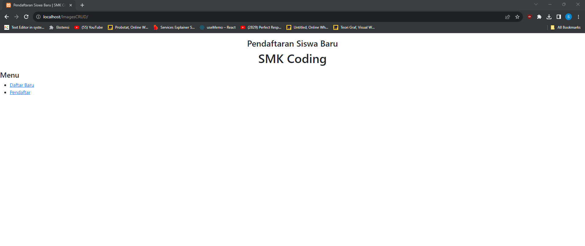
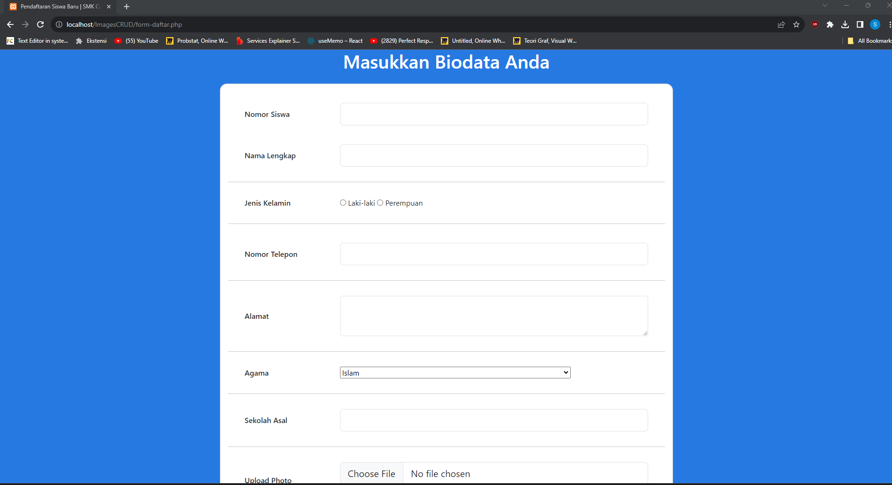
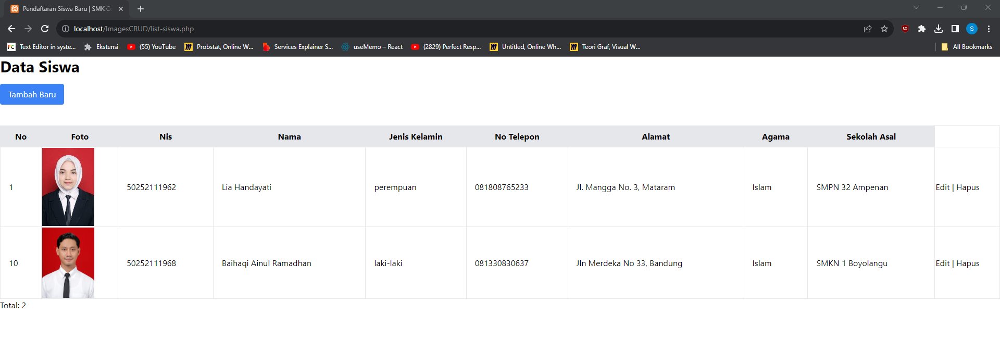

# ImagesUpload

## Make a CRUD Task to Import Images using php 

### Ini adalah tugas lanjutan yang sebelumnya untuk membuat dan mengimplementasikan website CRUD dngan menambahkan fitur upload image. User dapat mengedit dan menghapus gambar pada data yang dikirimkan

## Langkah - Langkah Yang Dilakukan :
## 1. Buat sebuah sistem database dalam localhost/phpmyadmin dengan nama pendaftaran_siswa. Masukkan query dalam phpmyadmin sebagai berikut 

```R
  CREATE DATABASE `pendaftaran_siswa`;
``` 

## 2. Lalu buat tabel dalam database pendaftaran_siswa dengan memasukkan table dengan nama calon_siswa dengan query sebagai berikut

```R
CREATE TABLE IF NOT EXISTS `calon_siswa` (
  `id` int(11) NOT NULL AUTO_INCREMENT,
  `nis` varchar(11) NOT NULL,
  `nama` varchar(50) NOT NULL,
  `jenis_kelamin` varchar(10) NOT NULL,
  `telp` varchar(15) NOT NULL,
  `alamat` text NOT NULL,
  `agama` varchar(15) NOT NULL,
  `sekolah_asal` varchar(200) NOT NULL,
  `foto` varchar(200) NOT NULL,
  PRIMARY KEY  (`id`)
) ENGINE=InnoDB DEFAULT CHARSET=utf8mb4 COLLATE=utf8mb4_general_ci;
``` 

## 3. Masukkan data siswa untuk mengetahui apakah data sudah masuk ke dalam database atau belum pada tabel calon_siswa dengan query sebagai berikut

```R
  
INSERT INTO `calon_siswa` 
(`id`, `nis`, `nama`, `jenis_kelamin`, `telp`, `alamat`, `agama`, `sekolah_asal`,`foto`) VALUES 
(NULL,'50252111962','Lia Handayati', 'perempuan', '081808765233', 'Jl. Mangga No. 3, Mataram','Islam','SMPN 32 Ampenan','images.jpg');
``` 

## Hasil dari program akan seperti berikut 

### 1. Hasil Utama Program


### 2. Melakukan Pendaftaran Baru


### 3. Tampilan Data Siswa Beserta Data Yang Baru Saja Dimasukkan


### 3. Melakukan Proses Edit Data

